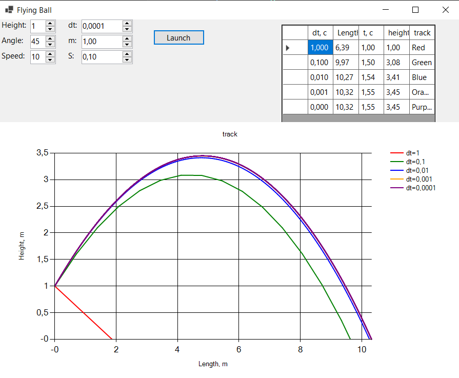

### Моделирование полёта тела в атмосфере

**Задание лабораторной работы:**  
Реализовать приложение для моделирования полёта тела в атмосфере.  
Предусмотреть возможность ввода шага моделирования и вывода результатов.

Выполнить моделирование **без очистки предыдущих результатов** для различных шагов моделирования, сравнить траектории и заполнить таблицу.
# Математическая модель: 
На тело, движущееся в атмосфере, действуют две основные силы: 
- сила тяжести: $F_g$ = m*g
- сила сопротивления воздуха: $F_d$ = 0.5 * rho * C * S * v^2, где rho - плотность воздуха 1.29 кг/м^3, C - коэффициентлобового сопротивления 0.15, S - площадь поперечного сечения м^2, v - скорость тела м/с
Проекции вектора ускорения на оси OX и OY: 
$$a_x = - \frac{F_d}{m} \cdot \frac{v_x}{v}$$ $$a_y = -g - \frac{F_d}{m} \cdot \frac{v_y}{v}$$

# Интерфейс и результаты моделирования

# Таблица
| Шаг моделирования, с | 1 | 0.1 | 0.01 | 0.001 | 0.0001 |
|----------------------|---|-----|------|-------|--------|
| Дальность полёта, м | 6,39  | 9,97    |  10,27    | 10,32      |10,32       |
| Максимальная высота, м |1 |3,08 |3,41 |3,45|3,45 |
| Скорость в конечной точке, м/с | ||| | |

**Выводы:**
- Сходимость результатов: траектории движения для шагов 0.01, 0.001, 0.0001 практически неразличимы. Разница в дальности составляет меньше 0.2 %
- Оптимальный шаг - 0.001 секунд, т.к. он дает отличную точность и погрешность от "эталонной" траектории < 0.25 %. Эталон - траектория при шаге 0.0001 сек.
