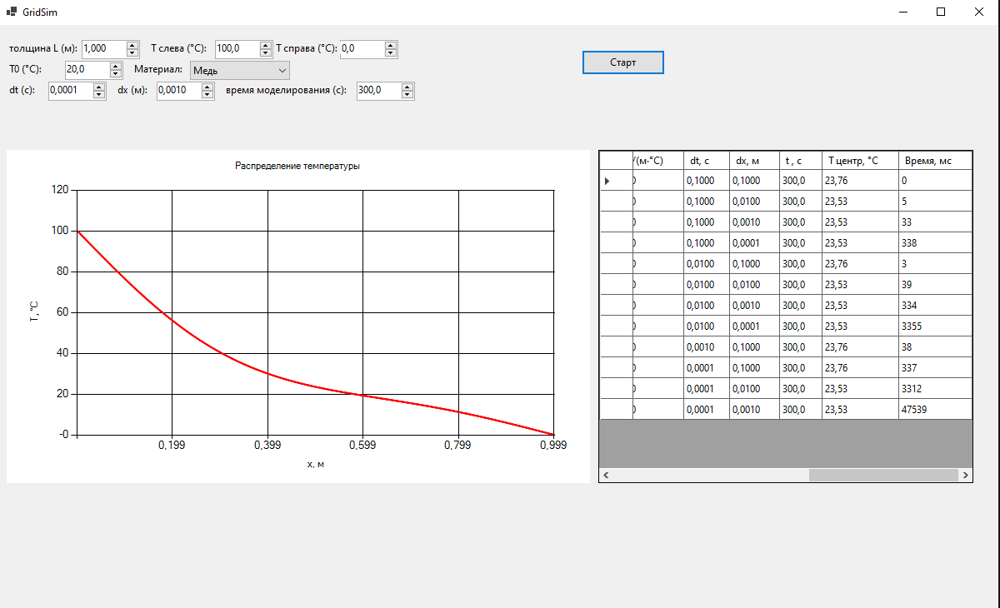

### Метод конечных разностей для уравнения теплопроводности

**Задание:**  
Реализовать моделирование изменения температуры в пластине на основе одномерного уравнения теплопроводности с использованием метода конечных разностей.

Выполнить моделирование с различными шагами по времени и по пространству.  
Заполнить таблицу значений температуры в центральной точке пластины после 2 секунд модельного времени.

## Основная формула
Рассматривается пластина толщиной $L$ с постоянными теплофизическими свойствами. Уравнение теплопроводности:

$$
\rho c \frac{\partial T}{\partial t} = \lambda \frac{\partial^2 T}{\partial x^2}, \quad 0 < x < L,
$$

где:
- $T(x,t)$ – температура,
- $\rho$ – плотность материала,
- $c$ – удельная теплоёмкость,
- $\lambda$ – коэффициент теплопроводности.

## Метод решения
Используется метод прогонки. 

$$
\rho c \frac{T_i^{n+1} - T_i^n}{\tau} = \lambda \frac{T_{i+1}^{n+1} - 2T_i^{n+1} + T_{i-1}^{n+1}}{h^2}.
$$

### Результаты моделирования

| Шаг по времени, с \ Шаг по пространству, м | 0.1 | 0.01 | 0.001 | 0.0001 |
|-------------------------------------------|-----|------|-------|--------|
| 0.1 | 23,76| 23,53|23,53 |23,53 |
| 0.01 |23,76 |23.53 | 23.53|23.53 |
| 0.001 |23,76 |23.53 | 23.53|23.53 |
| 0.0001 |23,76 | 23.53| 23.53| 23.53|

### График распределения температуры

